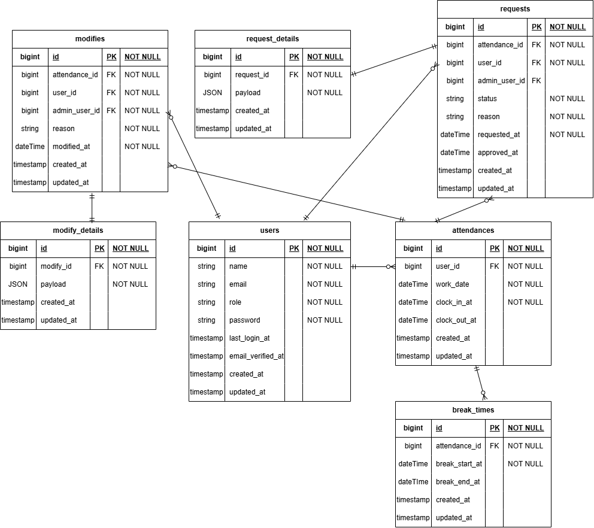

# アプリケーション名

勤怠管理アプリ

## 環境構築

### Docker ビルド

1. git clone git@github.com:Shuta0105/attendance-management-app.git
2. docker-compose up -d --build

### Laravel 環境構築

1. docker-compose exec php bash
2. composer install
3. cp .env.example .env
4. cp .env.example .env.testing
5. php artisan key:generate
6. php artisan key:generate --env=testing
7. 以下、「環境変数の変更」完了後
8. php artisan migrate --seed
9. php artisan migrate --env=testing

### 環境変数の変更

#### .env

1. DB_DATABASE=laravel_db
2. DB_USERNAME=laravel_user
3. DB_PASSWORD=laravel_pass

#### .env.testing

1. APP_ENV=test
2. DB_HOST=mysql_testing
3. DB_DATABASE=laravel_test
4. DB_USERNAME=laravel_user
5. DB_PASSWORD=laravel_pass

## ダミーデータ情報

ユーザーのパスワードはすべて「password」

## テスト

- コマンド

vendor/bin/phpunit tests/Feature/***

## 使用技術

- nginx 1.21.1
- php 8.1-fpm
- Laravel 8.83.29
- MySQL 8.0.26

## URL

- 開発環境：http://localhost/
- phpMyAdmin：http://localhost:8080/

## ER 図

